# Gupje
Gupje is a bare metal architecture based stub debugger that helps in post-exploitation steps. Like booting a device after RCE has been achieved. Gupje is also capable of doing hardware-in-the-middle approaches as well as keeping control over a device while it is booting(Hijack trustzone etc.). 

Gupje currently supporting the following architectures:
    * ARM64 (good support)
    * ARM (minimal)
    * ARM Thumb (decent support)

The goal is to add support to more targets while I work on them. Because I mainly work on phones this list will probably not grow a lot in the short term. But if you have an interesting target and preferably a way to get into it(RCE), let me know and I will look into it.

The only actual things the debugger can do is:
    * Send/Receive (needs to be implemented by the user)
    * Read/Write registers

These functions are enough for a processor to run properly. The code size of the debugger is currently smaller than 4096 bytes(depends a bit on user setup) but will probably grow to include 1 extra page to support custom functionality. Like dumping extra registers and more specific VBAR setups. 

In the future it should also be possible to add fuzzing and same architecture rehosting. Once I find a project to implement this at least.

## Overview
A simple overview of how Gupje is meant to be used can be seen below:



The user is responsible for gaining RCE and setting up Gupje. After this Gupje along with the ``Ghidra-Assistant`` can be used to interact with the device from within python and continue booting. 

### Gupje Setup
Because Gupje attempts to be a architecture based debugger the user only has to provide send/receive functionality to Gupje. Like sahara_tx/sahara_rx in Qualcomm based devices or a raw USB endpoint for the nvidia shield tablet.

```c

void send(void *buffer, uint32_t size, uint32_t *num_xfer){
    // TODO implement
}

int recv(void *buffer, uint32_t size, uint32_t *num_xfer){
    // TODO implement
    return 0;
}

void recv_data(void *data, uint32_t len) {
    uint32_t rx_err_code;
    uint32_t xfer = 0;
    while(1) {
        recv(data, len, &xfer);
        if(xfer >= len) {
            break;            
        }
    }
}

int mystrlen(char *data) {
    int i=0;
    while(1) {
        if(data[i++] == '\0'){
            break;
        }
    }
    return i-1;
}

void usb_log(char * msg, uint32_t * error){
    send(msg, mystrlen(msg), error);
}

void concrete_main(uint32_t debugger){
    // TODO device specific code
}
```

Other protocols, like UART, are also possible. I will try to add more reference devices and implementations. 

### Memory layout
Overall 4 pages are always reserved for the debugger. I usually try to place them at the end of a memory region since the chance of the pages being corrupted/used by other functions is smaller. 3 pages are required at least for the debugger to function properly.


## Documentation
The full documentation is covered in the ``documentation`` folder. To build it, navigate to the folder and run:
```bash
make livehtml
```
Install the python dependencies if they are missing. (TODO add requirements)

This code works in combination with the ``Ghidra Assistant``, which is another personal project to make Ghidra more instrumentable.

## TODO
    * ARM assembly needs to be completely rewritten
    * Add code that allows the host to easily write and execute shellcode on the device. This will significantly decrease the size of the debugger. (extra page required)
    * Add a more *minimal* approach to the debugger. That does not store data but can just be used to read/write memory. Usefull for exploitation when there is a very limited constraint on shellcode size.
    * Implement code block stepping.
    * Build an emulator to explain the debugger

### ARM64
    * Allow restoring all registers by writing X15 to SP and jump to ELRn to create a *full* restored state. Figure out a way to branch without corrupting X15.

### Thumb
    * headless mode is not supported
    * Figure out VBAR to implement single step debugging

## Building
Download an Android NDK and set it's root path:
```bash
$ export ANDROID_NDK_ROOT=$TOOLCHAINENV/android-ndk-r21_Linux
```

Now you can build one of your targets:
```bash
$ make -f devices/pixel3a/Makefile
```