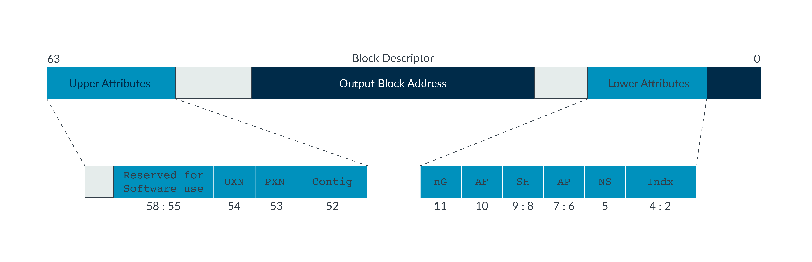

******************************
Memory Managment Unit on ARM64
******************************
This part describes the memory managment unit on ARM64 and how it is used by the debugger.

Single Level Pagetable at EL3
=============================
The documentation described here can also be found at the `official ARM documentation <https://developer.arm.com/documentation/102416/0100/Single-level-table-at-EL3>`_.

Translation Regime
******************
Register ``TCR_ELx`` is used to control the **Tranlation Regime** for the pagetables. The documentation for the ``TCR_EL3`` can be found in the `official ARM documentation <https://developer.arm.com/documentation/ddi0500/d/system-control/aarch64-register-descriptions/translation-control-register--el3>`_.

Translation Table
*****************
The location of the page table is located in register ``ttbr0_el3``. Depending of the configuration of ``TCR_EL3`` the bits for address selection can change.

More documentation can be found `here <https://developer.arm.com/documentation/ddi0595/2021-06/AArch64-Registers/TTBR0-EL3--Translation-Table-Base-Register-0--EL3->`_

Pagetable Entry
***************
The following diagram shows the format of a stage 1 level 1 table entry on EL3.

Automatic Paging
================
Automatic paging for page walking will be setup in the debugger. 
For this the ``ARM64_Concrete_State`` contains a mmu with class ``ARM64_MMU``. 

