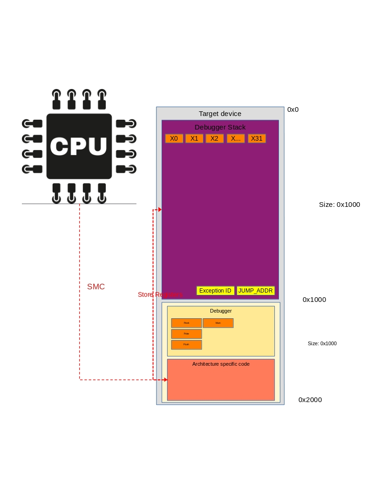

**********************
Vector Tables in ARM64
**********************
A lot of this documentation can also be found in the `ARM SMC calling convention documentation <https://www.google.com/url?sa=t&rct=j&q=&esrc=s&source=web&cd=&ved=2ahUKEwitkfqjqNz5AhUJHuwKHZ3vAj4QFnoECBMQAQ&url=https%3A%2F%2Fdocumentation-service.arm.com%2Fstatic%2F5f8ea482f86e16515cdbe3c6%3Ftoken%3D&usg=AOvVaw3QI7Lwrcg6B3BmQ5syZV70>`_

Vector Exception Levels
=======================

In ARM64 each there is a Vector table for each Exception level, except for EL0. So, in practice there is a Vector table for:

    * EL3 ``Secure Monitor Call (SMC)``
    * EL2 ``Hyper Visor Call (HVC)``
    * EL1 ``Super Visor Call (SVC)``

Documentation about this can be found in `the ARM documentation <https://developer.arm.com/documentation/100933/0100/AArch64-exception-vector-table>`_

.. image:: images/vector_table/vector_table_arm64.png

This vector table can be allocated and filled for each of the vector tables described above.

Setting the Vector Base Address
===============================
To set the location of this vector table a call ``MSR`` call can be done to ``VBAR_ELX`` which will write an address to that register. When an execption call is executed, this address is fetched and execution will move to that page, with the corresponding Execption Level(EL)

ARM SMC Calling Convention
==========================
When doing an SMC call in arm64 a synchronous exception is generated that is handled by the secure monitor in EL3. 
The SMC call can be in both 32 and 64 bit mode, depending on various bits in the instruction. 
For most phones this will be in 64 bit mode. 

When doing a SMC call, the register ``ELR_ELn`` is updated to show the location of where the call came from. 
This is the address after the call where the exception came from. When doing an ``ERET`` instruction this value is written to the ``PC``.

Stack Pointers
**************
Each Exception Level has its own stack pointers. The registers for these are:

* SP_EL0
* SP_EL1
* SP_EL2
* SP_EL3

``SP_EL3`` is innacessible in EL3, to read it you need to read the ``SP``.

****************************
Debugger VBAR Implementation
****************************

.. caution:: Docs are incomplete!

The debugger uses a SMC call to insert a breakpoint at any address. When a SMC call is thrown the processor jumps to the address pointed to in the ``VBAR_EL3`` register. 
This register **has to** point to the debugger. 
The debugger will first store all the registers in the storage location, overwrite the stack pointer and send the hello message ``b'GiAs'`` to the host. 

An overview of what is happening when a SMC call is dan can be seen below:

.. warning:: Currently register X15 gets corrupted when an SMC call is handled.

