==============
Gupje overview
==============

Gupje is a stub debugger that is designed to be minimal and requires 3 pages(0x1000) of data to be loaded on a target system.
A high level overview of how the memory mapping for this works is shown below.

.. note:: 

    In the future the debugger will probably grow to 4 pages, to include an extra page for the debugger to use in custom functionality.

Inner workings
--------------

When the debugger is entered it will save the state of the processor into it's storage page. This is done in assembly and is architecture dependent.
When a new architecture is added the first thing that needs to be done is to implement these functionalities.

The debugger will then wait for commands from the host. The host can send commands to the debugger to read/write memory, jump to an address, etc.

When the user is done it will send the ``REST`` command to the debugger. This will restore the state of the processor and jump to the address defined in ``DEBUGGER_JUMP``.

The debugger also uses a stack that is defined in the debugger. This is done to not taint the original stack of the processor.

API
---
The debugger has a simple API that is used to communicate with the device. The following commands are supported:

Memory Read(Peek)
=================
Read an address in memory to the host. 

The packet that is send is always 12 bytes, but depending on the address space(32/64 bit) the address will be 4 or 8 bytes. The last 4 bytes are the amount of bytes to read.

Memory Write(Poke)
==================
Write a buffer to an address in memory.

Get debugger main(SELF)
=======================
Get the main entry point of the debugger. This is used to jump to only the debugger without setting up the stack and registers again. 
This taints the device but is very usefull for debugging and showing where the debugger is in memory.

Concrete main(MAIN)
===================
Execute the ``concrete_main`` function. This function is fully user customizable and can be used to implement custom functionality. 
Like executing boot stages in a Qualcomm bootROM.

Flush Cache(FLSH)
=================
Execute architecture specific instructions in order to flush the cache.

.. note::

    Only arm64 is supported for this function. The support is there for arm and thumb but not implemented. Probably there will be a change here to support data/code cache flushes.

Jump to address(JUMP)
=====================
Simple function that will just jump to an address without restoring the stack or registers. Usefull for testing the debugger or relocating it.

Dump special registers(SPEC)
============================
Will dump the special registers to the host. This is architecture dependent and will only dump the registers that are supported. For ARM64 checks for each exception level are implemented.

Synchronize State(SYNC)
=======================
This function can be called from the debugger and will force write the registers from the saved state into the processor.

Sync Special(SYNS)
==================
Will force write the special registers from the saved state into the processor. Usefull for overwriting the ``VBAR_ELN`` and others. 
Not all registers are supported here and in the future this will probably be changed to be code pushed from the host to save space and support all special registers.

.. note:: 

    This function is currently only properly implemented for ARM64.

Restore and Jump(REST)
======================
This function restores the state of the processor from it's internal storage and jump's to the address defined in ``DEBUGGER_JUMP``. 

.. caution::

    Currently there is always a register corrupted on the jump function(we need to branch to a register). I have not found a good method to mitigate this(maybe ldr pc in arm/thumb but wont work for arm64)

Restore and Return(RRET)
========================
Does the same as ``Restore and Jump`` but instead of jumping it returns to the address that called the debugger(LR).

Glitching
---------
A debug flag is added for adding glitching to the debugger. The command ``GLIT`` will jump to the glitch function but this is not very well implemented yet. 
The goal is to add several testable glitch cases to the debugger for profiling.
